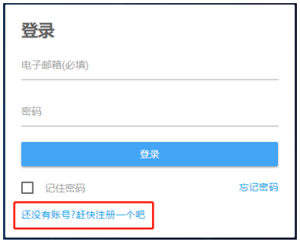
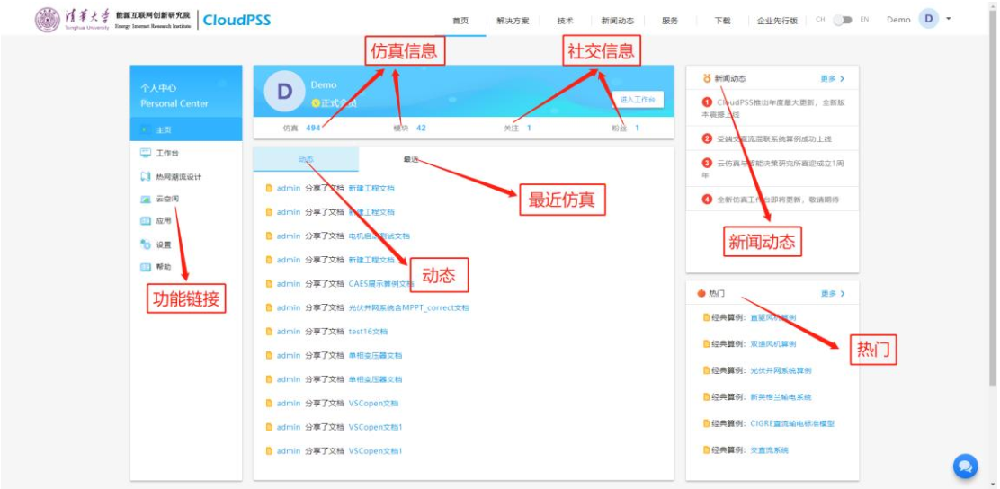
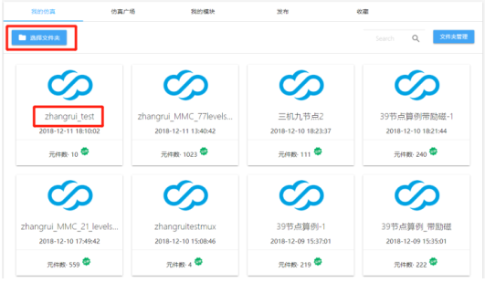
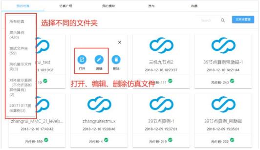

## 账号登录与注册

CloudPSS是一款基于网页的在线仿真软件，用户注册账号即可免费试用。打开浏览器(为保证最好显示效果，建议使用Chrome浏览器)，在浏览器地址栏输入<http://www.cloudpss.net/>，进入CloudPSS的网页主页。点击主页右上角的“登录”按钮，进入登录页面，如图所示。如用户已经建有账号，在登录页面的相应位置填写用户邮箱及登录密码，点击“登录”即可实现用户的登录。

若用户没有账号，点击“还没有账号？赶快注册一个吧”进入注册页面，如图所示。用户按照提示填写相应信息，点击“发送注册码”按钮对注册所用邮箱进行验证。此时，打开注册邮箱获取注册码，并将其填入注册页面相应位置，点击“注册”，即可完成对新用户的注册。注册成功后，页面将自动跳转至登录界面。

## 个人中心

登录成功后，页面将跳转至个人中心，如图所示。该界面包含功能链接、动态、最近仿真、仿真信息、社交信息、新闻动态以及热门算例。

### 功能链接

提供了相关功能的链接入口，具体为：
+ 主页：个人中心的主页面。
+ 工作台：电磁暂态仿真的工作界面。
+ 热网潮流设计：热网潮流仿真的工作界面。
+ 云空间：用户相关仿真、文档、模块等的存储空间。
+ 应用：用于仿真分析计算的实用化工具。
+ 设置：用于编辑用户信息等。
+ 帮助：用户帮助文档系统。

### 仿真信息

点击仿真信息>仿真/模块或功能链接>云空间都可进入用户储存空间，如图所示。该页面包含：
+ 我的仿真：用于存储用户的仿真工程文件。
+ 仿真广场：用于显示他人发布的仿真工程文件。
+ 我的模块：用于存储用户搭建的仿真模块。
+ 发布：用于存储用户发布的文档、仿真工程文件。
+ 收藏：用于存储用户收藏的文档、仿真工程文件。

点击我的仿真>选择文件夹可显示用户编辑的文件夹信息，文件夹划分有利于整理仿真文件。点击任一仿真文件名，可弹出文件操作窗口，可对仿真文件进行打开，编辑(所属文件夹，文件名称等)以及删除，如图所示。

### 动态

显示了用户最近的分享等内容。

### 最近
	
显示了用户最近操作过的仿真文件信息。
	
### 社交信息
	
显示用户关注或被关注的其他用户。
	
### 新闻动态
	
显示有Cloud PSS管理员发布的新闻信息。
	
### 热门
	
显示仿真广场中的热门仿真文件。

