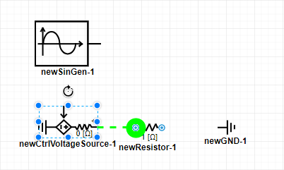
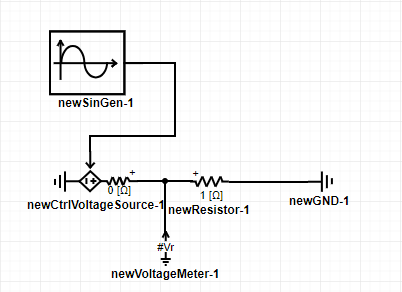
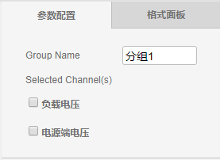

## 工程

### 新建工程

点击`菜单->文件->新建工程`后，会弹出一个名为`新建算例`的新工作窗口，按Esc键退出向导功能。在保存工程时，可以修改工程名。

### 打开工程

点击`菜单->文件->打开工程`后，将出现打开仿真对话框。用户可分别从`我的仿真`以及`仿真广场`两个地方打开所需的工程文件。

`我的仿真`中存储的是用户保存过的工程文件，其界面如下图所示，包含文件夹、文件列表以及缩略图，选择任意文件夹下的仿真文件，点击`打开`或`在新窗口打开`即可打开工程文件。

`仿真广场`中是其他用户对外部公开的工程文件，可供其他用户使用。其界面如下图所示，包含文件列表和缩略图，选择任意仿真文件，点击`打开`或`在新窗口打开`即可打开工程文件。

### 保存工程

点击`菜单->文件->保存工程`或`工具栏->快速保存`后，将弹出保存工程对话框，如下图所示。填入仿真的名称、仿真的编号以及仿真描述，选择存入的文件夹，点击保存按钮即可实现对工程的保存。另存为工程的操作与此类似，此处不再赘述。

## 仿真搭建方法

本节以一个简单的仿真算例为例(正弦受控电压源带阻性负载)，讲解算例的搭建及仿真过程。

### 放置元件

首先新建一个空白工程，点击元件列表内的元件，拖拽至工作空间即可完成对相应元件的放置。可利用快捷键、点击`菜单->编辑`或点击`工具栏->撤销/重做`进行元件的复制、粘贴、撤销、删除等操作。可利用鼠标长按元件进行拖动或选中元件后用键盘方向键对元件位置进行改变。点击元件上方的圆形箭头或利用[[Ctrl]]+[[R]]对元件进行旋转。元件放置结束后的工作空间如图所示。


不同工程窗口之间不允许进行元件的复制以及粘贴操作。


### 连接元件

将鼠标光标移至元件引脚处，若该引脚出现绿色圆形阴影，说明该引脚可用。此时单击该引脚，并移动光标可形成以绿色虚线形式存在的连接路径。在连线过程中，单击鼠标左键可以在该处设置连线拐点，点击鼠标右键可退出连线。当路径移动到可以连接的另一引脚时，该引脚处同样产生绿色圆形阴影，单击该引脚，即可实现两个元件的连接。元件连接示例如图所示。

若出现元件较多、连线不便的情况，可以通过“设置引脚”的方式对两个及以上的引脚进行连接。单击需要连接的元件，在工作空间的右侧会出现`参数配置`面板，在需要连接的引脚处标上相同的字符，即可实现连接，如下图所示。


+ 电气引脚与信号引脚不能互相连接。
+ 信号输入引脚不能并联，信号输出引脚不能并联。也即信号输出引脚需连接至另一信号输入引脚。
+ 引脚连接需满足维数要求。例如“三相交流电压源”的正端为三维电气引脚，不能直接与单相`电阻`的一维引脚连接，此时可加入`分线器`进行电气引脚拆分。同理，多维的信号引脚加入`多路信号合并`或`多路信号分离`元件进行拆分/聚合。


### 设置参数

在完成对元件的连接后，需对各个元件的参数进行设置。点击任一元件(以受控电压源为例)，工作空间右侧将出现如图所示的`参数配置`面板，编辑完成后，系统自动保存相关参数。

`参数配置`面板右侧为`格式面板`，用于设置元件的图标特性，如样式、文本以及排列，如下图所示。

### 添加测量元件

搭建完电路之后，需添加量测元件对电气量进行测量或输出，常用的量测元件有`电压表`、`支路电压表`以及`电流表`。以电压表为例，拖拽元件列表里的电压表至工作空间，并连接至电路。点击该元件出现参数配置面板，填写该电压表测得电压信号的名称，以#号开头。

此外，电气元件本身支持部分内部量输出，也即不需要外加量测元件，也可以输出测量信号。点击`元件->参数配置->参数->Monitoring`填写以#号开头的量测信号输出名称即可，操作方法如图所示。

更多关于信号名称的信息，详见：[参数系统使用方法](/features/ParameterSystem.html)。

### 波形输出

量测元件只对电气量进行采集，如需显示还需加入`输出元件`。 CloudPSS的输出波形显示需同时用到`示波器分组`以及`波形通道`两个元件。`波形通道`类比与实际物理示波器的探头，`示波器分组`类比于任意通道数的实际物理示波器。

拖拽`波形通道`元件至工作空间，单击设置参数，如下图所示。通道名称设定为：负载电压，采样频率设定为1000Hz，采样频率越高，输出显示波形越精确，但数据量大，影响显示速度。输入信号维数设定为1，因为采集得到的负载电压为1维。输入引脚填写为以#号开头的电压表测量输出信号名称#Vr。同理再添加一个“波形通道”，用以显示受控电压源Monitoring输出信号#V1，如下图所示。

拖拽`示波器分组`元件至工作空间，单击设置参数，如下图所示。该元件自动识别输出通道名称，勾选需要显示的波形通道，若波形通道未命名，将采用默认命名。填写该元件的名称为分组1。

至此工作空间的仿真内容全部搭建完毕，总的仿真图如下图所示。

### 仿真控制

点击工作空间空白处，对右侧的`电磁暂态`面板进行操作，填写仿真时间及步长，如下图所示。点击`仿真控制->开始`将弹出计算节点选择，选择神威节点，然后弹出仿真结果窗口。

仿真结果如下图所示。

滑动坐标轴灰色滑块两端可调节显示坐标范围，坐标轴底端显示了接入的波形通道名称，右上角为波形控制，可实现：区域缩放(放大某一区域的波形)，区域缩放还原(退回上一次区域缩放前)，还原(回到原始显示波形)，保存为图片(浏览器自动下载仿真结果图片)。点击左上角结束，点击`分享内容`可形成分享文档，如图所示。

点击文档右上角的关闭按钮，点击仿真结果左上角的关闭按钮，结束本次仿真。

