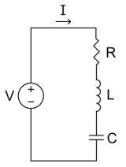
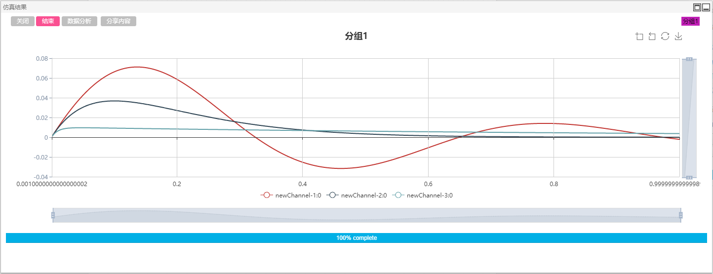
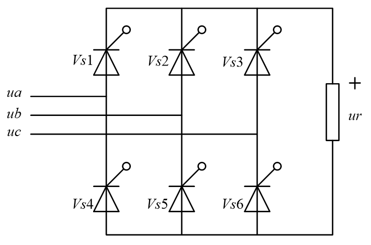

本章对两个简单的案例进行仿真示例，以帮助用户更好理解CloudPSS的使用规则及方法。

## 简单RLC电路仿真

### RLC串联电路原理

RLC电路是由电阻、电感、电容组成的二阶电路结构，如图所示。电路中的电压或电流是一个二阶微分方程的解，其系数是受其电路结构决定。当电路元件都视为线性元件时，一个RLC元件可以被视作一个谐波振荡器。

电路工作时，三个元件均与电压源以串联方式连接，根据基尔霍夫电压定律(KVL)可得电路的回路电压方程为：
$$ Ri(t) + L\frac{ {di} }{ {dt} } + \frac{1}{C}\int\limits_{ - \infty }^{\tau  = t} {i(t)d\tau  = v(t)} $$

当电源电压为常数时，对上式求导，整理可得如下的二阶微分方程：
$$\frac{ { {d^2}i(t)} }{ {d{t^2} } } + \frac{R}{L}\frac{ {di(t)} }{ {dt} } + \frac{1}{ {LC} }i(t) = 0$$

令$\alpha  = \frac{R}{L}$，${\omega _0} = \frac{1}{ {\sqrt {LC} } }$，其中$\alpha$为衰减量，$\omega _0$为共振角频率。定义阻尼系数为：

$$ \zeta  = \frac{\alpha }{ { {\omega _0} } } = \frac{R}{2} \sqrt {\frac{C}{L} } $$ 

由电路理论可知，电路元件参数不同会导致阻尼系数不同，从而引起电路中电压、电流等电气量在零状态响应时会产生不同的变化形式。对回路电压方程进行求解，可得该微分方程的通解为两个指数函数的线性叠加：

$$i(t) = {A_1}{e^{ - {s_1}t} } + {A_2}{e^{ - {s_2}t} }$$

系数$A_1$，$A_2$由具体问题的边界条件给出。

以下分别对$\zeta$变化造成的三种不同变化情况进行介绍。

+ 过阻尼响应($\zeta >1$)

  过阻尼响应为：
  $$i(t) = {A_1}{e^{ - {\omega _0}(\zeta  + \sqrt { {\zeta ^2} - 1} )t} } + {A_2}{e^{ - {\omega _0}(\zeta  - \sqrt { {\zeta ^2} - 1} )t} }$$

  过阻尼响应是一个瞬时电流无振荡的衰减。

+ 欠阻尼响应($\zeta <1$)

  欠阻尼响应为：
  $$i(t) = {B_1}{e^{ - \alpha t}}\cos ({\omega _d}t) + {B_2}{e^{ - \alpha t}}\sin ({\omega _d}t)$$

  欠阻尼响应是一个按频率为 ${\omega _d} = {\omega _0} \sqrt {1 - {\zeta ^2} }$ 衰减的振荡，它是电路在无外部源驱动时的自然振动频率。$B_1$以及$B_2$为任意常数，由边界条件决定。

+ 临界阻尼响应($\zeta =1$)

  临界阻尼响应为：
  $$ i(t) = {D_1}t{e^{ - \alpha t} } + {D_2}t{e^{ - \alpha t} }$$

  其响应与过阻尼响应类似。

### 仿真分析

由CloudPSS实现的RLC串联电路仿真模型如图所示。

拖拽直流电压源、电容、电感、电阻、电流表、输出通道以及示波器分组元件至工作空间，设置电路中直流电压源参数为0.1kV，电压上升时间为0.001s，电感参数为0.1H，电容参数为100000uF，电阻参数分别为0.5Ω、2Ω、10Ω，电流表输出信号分别设置为#I1、#I2、#I3，输出通道的输入引脚分别设置为#I1、#I2、#I3，示波器分组选择为该三路输出通道。仿真结果如图所示。

## 三相桥式全控整流电路

### 整流电路原理

三相桥式全控整流电路是工业中应用最为广泛的一种整流电路，其实质是一组共阴极与一组共阳极的三相半波可控整流电路的串联，如图所示。图中,晶闸管VS1、VS2、VS3、为共阴极组，晶闸管VS4、VS5、VS6为共阳极组。

在交流电源的一个周期内，晶闸管在正向阳极电压作用下不导通的电角度称为控制角或移相角，用α表示。在三相可控整流电路中，控制角的起点，不是在交流电压过零点处，而是在自然换流点(又称自然换相点)，即三相相电压的交点。采用双窄脉冲触发时，触发电路每隔60°依次同时给两个晶闸管施加触发脉冲，每周期的触发顺序为1/5-1/6-2/6-2/4-3/4-3/5。

下图示出了α角分别为0°、60°以及90°时的理论开关及输出波形。

### 仿真分析

由CloudPSS搭建的带纯电阻负载的三相整流桥如下图所示。

拖拽三相交流电压源、分线器、晶闸管、电阻、电压表、方波发生器、加法器、延时环节、输出通道以及示波器分组至工作空间。设置三相电压源线电压0.1kV、频率50Hz、电压上升时间0s；晶闸管参数保持为默认值；方波发生器分别设置为间隔60°、占空比0.01、频率50Hz的方波；加法器用于形成双窄脉冲波形；延时环节的延时时间设置为全局变量\$T，并在全局变量窗口填写响应的参数、最大采样点数设置为500；电压表用于测量负载电压，名称标号为#Vr；输出通道的输入引脚设置为#Vr，示波器分组用于显示该输出通道的波形。分别设置全局参数\$T为0.00001s、0.00333s和0.005s，三次的仿真结果如下图所示。

