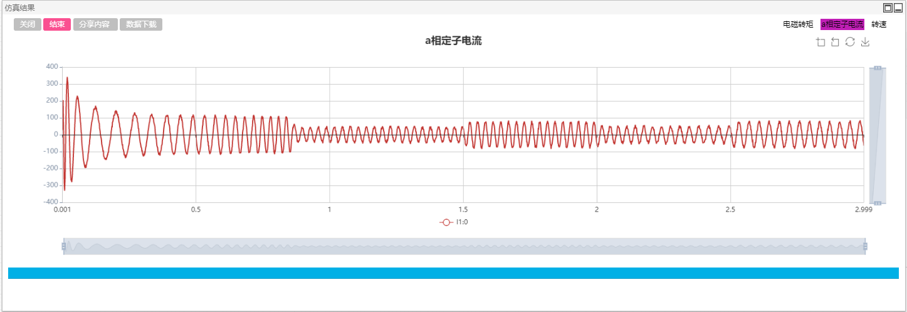
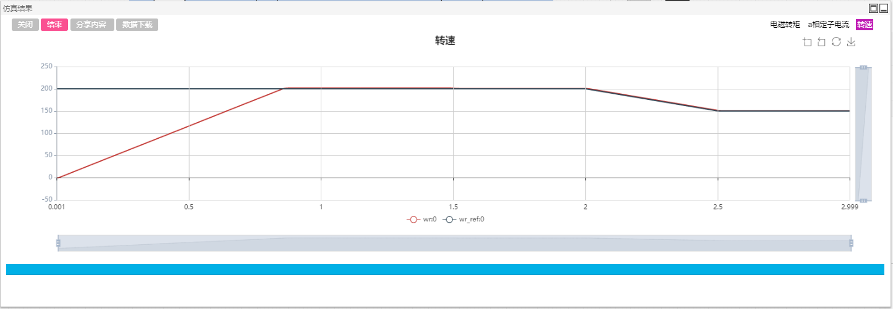

## 描述
变频调速技术具有调速范围广、调速精度高、动态响应好等优点，使用变频器可以大大提高交流电机转速和力矩的控制精度。

本算例基于磁场定向矢量控制方法实现对三相交流异步电机的控制，利用坐标变换将定子电流的励磁分量和转矩分量独立开来，进而实现电机转速和磁链的解耦，分别进行控制。

## 模型介绍

异步电机矢量控制测试算例主功率拓扑由三相电压源变换器、三相异步电机以及直流电压源构成，仿真拓扑如下图所示。其中，速度外环的输出为电磁转矩的参考值，经过计算公式后得到内环定子电流的q轴分量参考值。为了控制简单， 以开环方式维持转子磁链为常值，直接根据期望值0.96计算得到内环电流的d轴分量参考值。内环电流控制器采用滞环控制，具有较快的响应速度，但其输出开关波形频率不固定，会导致电流纹波较大。

## 仿真
点击工作空间右侧的“全局参数”栏，填写机械转矩切换时刻\$T_Tm_change为1.5s，转速外环的转速参考切换时刻\$T_Speed_change为2s。点击格式面板->电磁暂态>仿真控制>开始，选择相应的计算节点并开始仿真计算。

电磁转矩的仿真结果如下图所示：

a相定子电流的仿真结果如下图所示：

转速的仿真结果如下图所示：

根据仿真结果，转子转速从0 开始向上爬升，此时电磁转矩输出为最大限幅值300N.m，当速度达到稳态后，电磁转矩约等于机械转矩，为100N.m。机械转矩在1.5s发生突变，变化为200N.m。此时机械转矩快速上升达到约200N.m。转子速度保持不变，验证了速度外环的有效性。此后，在2s时刻速度参考下降，电磁转矩减小，并在2.5s保持速度不变，电磁转矩重新达到200N.m。
