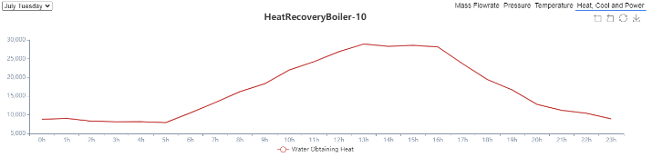

## 模型描述

选取某分布式综合能源系统作为建模仿真的研究对象，该案例为分布式供冷供热供电的区域级综合能源系统，系统中有两个220千伏的主变电站和六个110千伏变电站。主要设备包括可再生能源发电设备（光伏和风电）、蓄电池、燃气轮机、吸收式制冷机、燃气锅炉、电压缩制冷机、变压器、输电线路，并且和公共电网连通，系统结构拓扑如下图所示：

*模型拓扑结构图如下：*

## 模型参数及边界条件

1. 输入设备额定参数和运行参数
2. 输入气象参数如典型日光照辐射强度参数
3. 输入典型日电、热、冷负荷参数
4. 输入各设备的运行策略

负荷参数

系统负荷主要有电负荷、冬季供暖负荷和夏季制冷负荷，以某负荷用户为例，其典型日下的负荷数据如下表所示：

*电负荷：*

## 结果分析

利用CloudPSS-IESLab平台对分布式供热的综合能源系统进行为期一年的仿真，并对各项计算结果进行分析。

### 供电分析：

可再生能源（光伏和风力发电）在能源结构改革和综合能源系统中发挥了重要作用。结果表明，可再生能源发电功率在25～45MW之间，日发电量占总发电量的19.60%。

### 供热分析：

冷热电联产（CCHP）系统是典型的IES单元，是一种实用的能源综合梯级利用解决方案。在本案例中，燃气轮机、余热锅炉和吸收式制冷机相组合实现冷热电联产，主要过程可以描述为：燃气轮机发电过程中产生大量高温烟气，其热量由余热锅炉回收产生高温热水，作为吸收式制冷机的热源实现制冷和供热。通过梯级利用可以提高整体能源利用效率，这是综合能源系统的主要优势之一。
某典型日下该冷热电联产单元的发电供热制冷量如下图所示：

### 经济性和环保性分析：

用户可以在CloudPSS-IESLab平台的计算结果基础上进行进一步的分析。对于综合能源系统，经济性和环保性是重要的两个指标。我们收集了主要设备经济参数和二氧化碳排放系数，如下所示：

*主要设备经济参数：*

*主要设备二氧化碳排放系数：*

在上述参数的基础上，计算了项目投资和二氧化碳年排放量，其结果如下所示：

