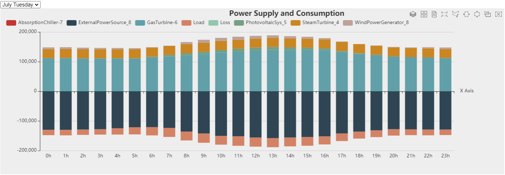
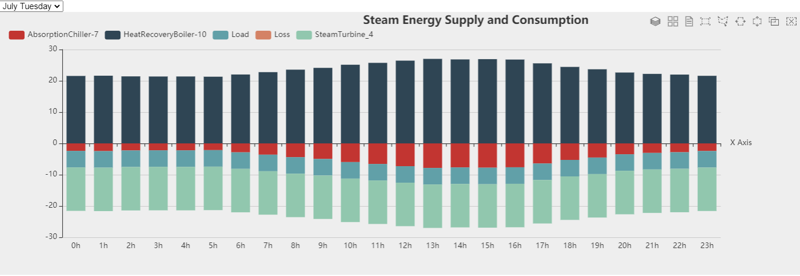
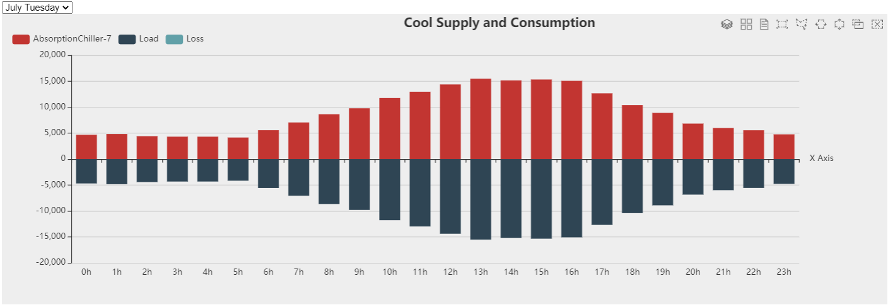

## 模型描述

蒸汽在工业中是一种重要的工质，应用在饮料、烟草、造纸、轮船、饲料、医院、啤酒、油脂、轮胎、宾馆、乳品等各行各业。主要为工艺设备的温度控制提供热源。本案例搭建了一个以蒸汽利用为核心，同时包含电热冷的综合能源系统，其拓扑结构如下图：

*模型拓扑结构图如下：*

## 仿真参数设置

1. 输入设备额定参数和运行参数
2. 输入气象参数如典型日光照辐射强度参数
3. 输入典型日电、热、冷负荷参数
4. 输入各设备的运行策略

## 结果分析

利用CloudPSS-IESLab平台对以蒸汽利用为核心的综合能源系统进行为期一年的仿真，并对各项计算结果进行分析。

### 供电分析：

### 供汽分析：

### 供冷分析：

### 蒸汽利用分析：

该系统是一个冷热电联产系统，在本案例中，燃气轮机、余热锅炉、蒸汽轮机和吸收式制冷机相组合实现冷热电联产，主要过程可以描述为：燃气轮机发电过程中产生大量高温烟气，其热量由余热锅炉回收产生高温蒸汽，供蒸汽轮机发电并作为吸收式制冷机的热源实现制冷和供热，通过梯级利用可以提高整体能源利用效率。

