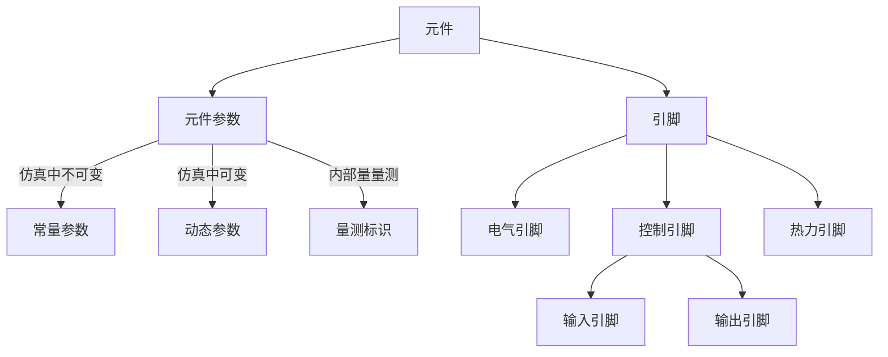
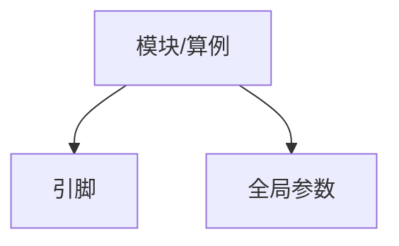

CloudPSS工作台提供了一套以参数（Parameter）和引脚（Pin）为核心的建模系统。用户可使用不同类型的参数实现对元件、模块和算例的灵活维护和管理，进而实现各种高级仿真功能。

如图，CloudPSS中的每个元件和模块的配置面板都包含`参数`和`引脚`两个部分。
1. `参数`是定义及描述元件（或模块）特征的度量数据（如额定电压、电阻值等信息）。根据参数在仿真过程中是否可变，又可分为`常量`和`动态`两类。另外，根据参数的作用域不同，作用于模块范围、算例范围的参数为`全局参数`，作用于单个元件的参数为`元件参数`。
1. `引脚`是元件（或模块）与外部系统连接的输入输出接口。根据元件类型的不同，引脚可分为`电气引脚`、`控制引脚`、`热力引脚`等不同类型。类型不同的引脚不能相连。`控制引脚`为有向引脚，根据数据流方向又分为`输入引脚`和`输出引脚`两类。

## 常量参数

常量参数，分为整数型（Integer）、双精度实数型（Double）、字典型（Dictionary）、文本（Text）、表格（Table）五类。用户可直接在元件的参数列表框输入/选择相应类型的参数值。设定双精度实数型参数时支持输入**全局参数标识符**、以及包含**全局参数标识符**的[math.js表达式](//mathjs.org/)。部分双精度实数型参数带有单位量纲，在输入数据和表达式时需注意单位换算。

## 引脚（元件、模块）

每个元件、模块和算例都具备可互相连接的接口（端子），称为`引脚`。引脚之间的连接方式有线连接、信号名连接和混合连接三种，如图所示。

1. **线连接**：即直接利用“连接线”即可连接相应的引脚。
1. **信号名连接**：在参数配置页面，指定连接到引脚的`信号名称`。若不同元件的`引脚`之间标注了相同的`信号名称`，则其相应的引脚即被认为是相连的。为便于区分`引脚名称（Pin Name）`和`信号名（Signal Name）`，`引脚名称`的默认颜色为黑色，`信号名称`的默认颜色为蓝色。 
1. **混合连接**：即可同时使用上述两种连接方式。如图。

## 全局参数 

全局参数为算例（或模块）范围内的全局变量。全局参数标识符以“$”标识符为前缀，可在算例（或模块）范围内被各个元件使用。全局参数以字典的形式存储，可在右侧`控制面板`->`全局参数`->`编辑全局参数`处进行编辑。
 

每个全局参数包含`全局参数标识符`、`数值/表达式`、`全局参数描述`、`全局参数组名`四个设置选项。其中，
1. `全局参数标识符（Identifier）`以“$”标识符为前缀，是全局参数的唯一标识符，可在算例或模块内填写元件参数时引用。
1. `数值/表达式（Value/Expression）`定义了全局参数的数值或包含全局参数的[math.js表达式](//mathjs.org/)。
1. `全局参数描述（Parameter Description）`定义了全局参数的描述文字，显示在`控制面板`->`全局参数`->`全局参数列表`中的`Parameter`一项。
1. `全局参数组名（Group Name）`定义了全局参数的分组，用于在`全局参数列表`中控制全局参数的分组显示。

配置好全局参数信息后，可在`全局参数列表`中快速编辑每个全局参数的`数值/表达式`。

在使用全局参数过程中，需要注意以下几点：
1. 全局参数仅用于配置元件参数，因此必须在仿真开始前赋值，参数在仿真过程中不可改变。
1. 全局参数表支持复制、粘贴、自动填充功能。用户可将全局参数导入进Excel等表格工具继续处理，再粘贴回CloudPSS平台。
1. 后定义的全局参数可引用较先定义的全局参数，反之不可以。如图。

    

## 动态参数

动态参数等同于元件（或模块）的输入信号名称。动态参数以`@`标识符为前缀，其使用方法与一般的元件名称相同。

## 量测标识

量测标识等同于元件（或模块）的输出信号名称。量测标识以“#”标识符为前缀，其使用方法与一般的元件名称相同。元件`Monitoring`参数页的全部参数、电压表、电流表中的`Name`参数均为量测标识类参数。


**特殊用法**

`电气引脚`可以与`控制-输入引脚`直接相连，此时，传入控制系统的数值为电气引脚处的**节点电压（单位：V）**。但CloudPSS不建议此类用法。常规的操作是利用电压表测量节点电压，并利用`量测标识`传入控制系统。
