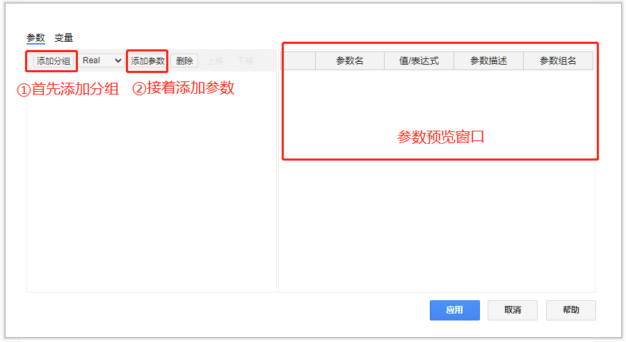
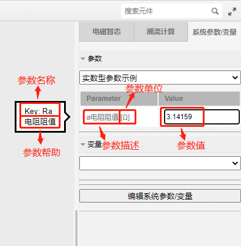
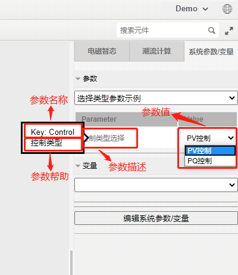
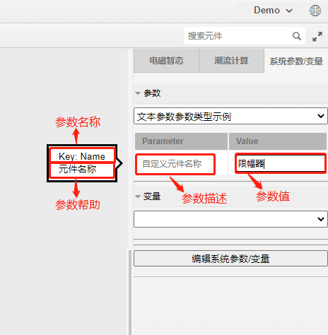
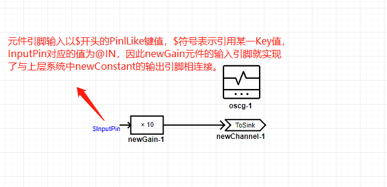

## 系统参数编辑方法

点击右侧格式面板中的“系统参数/变量”，然后选择“编辑系统参数/变量”，即可进入系统参数/变量编辑窗口，如下图所示：

### 添加、编辑、删除参数分组

点击“添加分组”即可添加新的系统参数分组，参数分组有利于对参数属性进行分类管理。在添加参数分组时，可进行如下配置：

| 名称 | 描述 | 示例 |
| :--- | :--:  | :--- |
|Name | 分组名称 | 如，控制参数 |
|Description | 分组描述 | 如，控制系统参数 |
|Condition|参数显示的条件，可输入逻辑表达式|如, ture|

选中分组，并点击“删除”，即可删除当前分组。

### 添加、编辑、删除系统参数

鼠标单击选定某一参数分组，然后点击“添加参数”，即可在该分组下添加参数。选中某一参数，并点击“删除”，即可删除当前参数。在添加参数时可以选择不同的参数类型，包括实数型（Real）、整型(Integer)、字典类型(Choice)、文本类型（Text）、类引脚型（PinLike）五种类型。默认（Legency）类型只用于兼容旧版全局参数，无法新建该类型参数。

不同参数类型的详细配置方法如下所示：

**1. 实数型**

实数型参数配置如下所示：

| 名称 | 描述 | 示例 |
| :--- | :--:  | :--- |
| Key| 	参数名称| 	如，Ra|
| Parameter Type| 	Real| 	实数类型选“Real”|
| Value| 	填入参数页的参数值，输入非实数会报错| 	如，3.14159|
| Description| 	参数描述| 	如，电阻a的阻值|
| Unit| 	参数单位|	如，Ω|
| Min	| 参数下限，Value值小于下限报错| 	如，0|
| Max	| 参数上限，Value值大于上限报错| 	如，1e9|
| Help| 	参数帮助文字	| 如，电阻阻值|
| Condition	| 参数显示的条件，可输入逻辑表达式| 如, ture|

点击应用后，在右侧系统参数/变量栏的显示如下图所示(该例中参数分组的Description为实数型参数示例)：

**2. 整数型**

整数型参数配置如下所示：

| 名称 | 描述 | 示例 |
| :--- | :--:  | :--- |
|Key|参数名称|如，N|
|Parameter Type|Integer|整数型选“Integer”|
|Value|填入参数页的参数值，输入非整数会报错|如，60|
|Description|参数描述|如，MMC上桥臂模块数|
|Min|参数下限，Value值小于下限报错|如，1|
|Max|参数上限，Value值大于上限报错|如，10000|
|Help|参数帮助|如，上桥臂模块数|
|Condition|参数显示的条件，可输入逻辑表达式|如, ture|

点击应用后，在右侧系统参数/变量栏的显示如下图所示(该例中参数分组的Description为整数型参数示例)：

**3. 选择类型**

选择类型参数配置如下所示：

| 名称 | 描述 | 示例 |
| :--- | :--:  | :--- |
|Key|参数名称|如，Control|
|Parameter Type|Choice|选择类型选“Choice”|
|Value|填入参数页的参数值|如，0|
|Description|参数描述|如，控制类型选择 |
|Choice|点击可打开选择键值配置窗口，输入键值及描述|如，键值0对应PV控制,键值1对应PQ控制|
|Help|参数帮助|如，控制类型|
|Condition|参数显示的条件，可输入逻辑表达式|如, ture|

选择键值配置窗口如下图所示：

点击应用后，在右侧系统参数/变量栏的显示如下图所示(该例中参数分组的Description为选择类型参数示例)：

**4. 文本类型**

文本类型参数配置如下所示：

| 名称 | 描述 | 示例 |
| :--- | :--:  | :--- |
|Key|参数名称|如，Name|
|Parameter Type|Text|文本类型选“Text”|
|Value|填入参数页的参数值|如，限幅器|
|Description|参数描述|如，自定义元件名称|
|Help|参数帮助|如，元件名称|
|Condition|参数显示的条件，可输入逻辑表达式|如, ture|
|Regex|||
|RegexErrorMessage|||

点击应用后，在右侧系统参数/变量栏的显示如下图所示(该例中参数分组的Description为文本类型参数示例)：

**5. PinLike类型**

通过配置PinLike类型参数可实现系统的虚拟输入输出引脚。PinLike类型参数配置如下所示：

| 名称 | 描述 | 示例 |
| :--- | :--:  | :--- |
|Key|参数名称|如，A|
|Parameter Type|PinLike|PinLike型选“PinLike”|
|Value|填入参数页的参数值，输入类型填填写以@开头的字符串，输出类型填写以#开头的字符串|如，@IN。或如，#OUT|
|Description|参数描述|如，启动输入信号。或如，量测输出信号|
|Help|参数帮助|如，输入以@开头的信号名。或如，输入以#开头的信号名|
|Condition|参数显示的条件，可输入逻辑表达式|如, ture|
|Dim X|所连接虚拟引脚的维度，行数|如，1|
|Dim Y|所连接虚拟引脚的维度，列数|如，1|
|Connection Type|连接类型“输入”或“输出”|如，Input。或如，Output|
|DataType|数据类型，目前默认只支持Real|如，Real|

**例1**:需要给子系统(SubSystem)配置一个虚拟的输入引脚，填写Key为InputPin、Parameter Type为PinLike、Value为@IN、Description为虚拟输入引脚、Help为输入以@开头的信号名、Condition为ture、Dim X为1、Dim Y为1、Connection Type为Input、DataType为Real。此时上级系统(Main)中的子系统参数页及参数输入方法如下图所示：

在子系统(SubSystem)内，使用该虚拟输入引脚的方法如下图所示：

**例2**:需要给子系统(SubSystem)配置一个虚拟的输出引脚，填写Key为OutputPin、Parameter Type为PinLike、Value为@OUT、Description为虚拟输出引脚、Help为输入以#开头的信号名、Condition为ture、Dim X为1、Dim Y为1、Connection Type为Output、DataType为Real。此时上级系统(Main)中的子系统参数页及参数输处方法如下图所示：

在子系统(SubSystem)内，使用该虚拟输入引脚的方法如下图所示：

总结来说，系统端口元件给系统提供了与外部电路连接的实体引脚，而PinLike参数提供了与外部电路连接的虚拟引脚。

**6. Legency类型**

Legency类型参数是为了兼容老版本全局参数而设计的参数类型，其配置如下所示：

| 名称 | 描述 | 示例 |
| :--- | :--:  | :--- |
|Key|参数名称|如，A|
|Parameter Type|Legency|Legency型选“Legency”|
|Value|填入参数页的参数值，为real类型数|如，100.0|
|Description|参数描述|$A|
|Help|参数帮助|如，变量A|
|Condition|参数显示的条件，可输入逻辑表达式|如, ture|

点击应用后，在右侧系统参数/变量栏的显示如下图所示：

## 系统变量编辑方法

系统变量的编辑方法与系统参数相同。**需要注意的是：系统参数可以由上级系统传入，而系统变量只能作用于本系统。**
