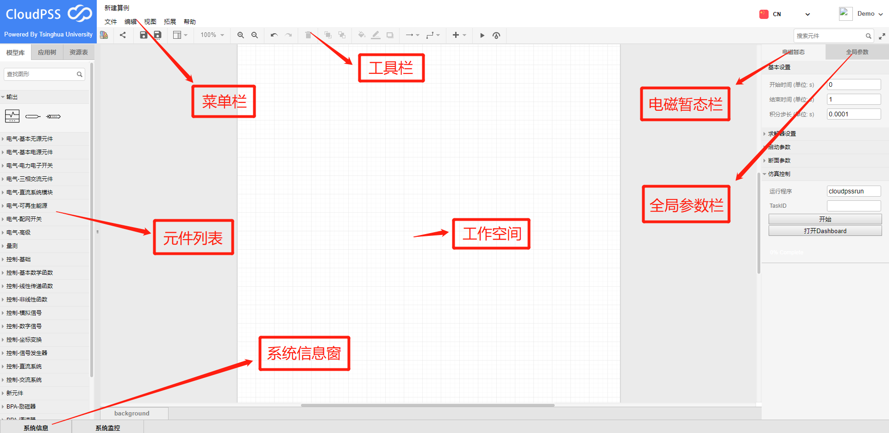
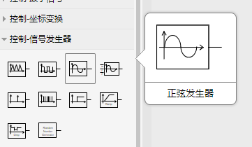

工作台是CloudPSS进行电磁暂态仿真的核心，该界面包含菜单、工具栏、元件列表、工作空间、系统信息窗、系统监控窗、电磁暂态栏以及全局参数栏，各部分位置情况如图所示，现分别针对各部分进行详细介绍。 

## 菜单

菜单项包括：文件、编辑、视图以及帮助。

## 工具栏

工具栏列出了仿真常用/快捷的操作选项，包括打开向导、分享(生成仿真文档)、保存、另存为、视图(打开/关闭格式面板和缩略图)、缩放、放大、缩小、撤销、重做、删除、置于顶层、置于底层、填充颜色、线条颜色、阴影、连接、拐点、插入(链接和图像)、开始仿真、dashboard。

## 元件列表

元件列表中提供了用于仿真的各类元件。根据其不同的输入输出及连接特性，将其分为“量测”、“输出”、“电气”、“控制”以及“工具”等类型。通过对不同元件的连接组合可形成大型的仿真系统。元件的分类及详细组成如下表所示：

| 分类 | 元件 |
| :--- | :---  |
| 输出 | 示波器分组、支路电流测量、波形通道|
| 量测 | 支路电压表、电压表、电流表、RMS量测、三相功率量测、锁相环、傅里叶变换|
| 电气-基本无源元件 | 接地点、电阻、电感、电容、单相故障电阻、三相故障电阻|
| 电气-基本电源元件 | 直流电流源、直流电压源、单相交流电压源、受控电流源、受控电压源、受控交流电压源（VF）、受控交流电压源（VP） |
| 电气-电力电子开关 | 二极管、晶闸管、IGBT |
| 电气-三相交流元件 | 并联电容/电抗器、静态负载、分线/集线器、三相传输线、三相交流母线、三相交流电压源、三相双绕组变压器、三相三绕组变压器、同步发电机 |
| 电气-直流系统模块 | 半桥子模块、六脉动晶闸管桥 |
| 电气-可再生能源 | 光伏电池电池单元、铅酸蓄电池 |
| 电气-配网开关 | |
| 电气-高级 | userdefined、SubCase |
| 控制-基础 | 常量输入、时间、仿真步长、控制悬空端、手动解环点、多路信号分离、多路信号合并、OctaveCode |
| 控制-基本数学函数 | 加/减法器、乘法器、除法器、最大/最小值、周期最大/最小值、绝对值、符号函数、三角函数、指数函数、对数函数、幂函数、取整函数 |
| 控制-线性传递函数 | 增益、一阶惯性环节、零点、积分器、微分器、PI调节器、超前滞后环节、微分极点、共轭极点传递函数、高阶线性传递函数 |
| 控制-非线性函数 | 延迟环节、限幅环节、三段分段线性函数、角度标准化、非线性函数 |
| 控制-模拟信号 | 采样、采样保持、比较器、滞环比较器、过零检测、快速傅里叶变换、锁相环 |
| 控制-数字信号 | 选择器、逻辑门、触发器、延迟触发器、单稳态触发器、边沿检测器 |
| 控制-坐标变换 | Clarke变换、极/直角坐标变换、静止/旋转变换、Park变换 |
| 控制-信号发生器 | 脉冲发生器、三角波发生器、方波发生器、正弦波发生器、可调正弦波发生器、阶跃发生器、单脉冲发生器、浪涌波形发生器、斜坡发生器、陷落发生器、随机数发生器 |
| 控制-直流系统 | 锁相振荡器、最近电平调制 |
| 控制-交流系统| ST5B、Hydro Governor、 Hydro Turbine |

用户查找元件时，可在列表上方搜索栏内填入元件名称，回车即可搜索到所需元件。下图示出了对`电阻`的搜索结果。用户也可根据所需元件的特性，依照元件列表分类自行查找。例如需查找正弦发生器，可在`控制-信号发生`类别下进行查找，结果如图所示。

## 工作空间

工作空间是用于放置、连接元件，搭建仿真系统的窗口。

### 页面缩放方法

可利用键盘[[Alt]]和鼠标滑轮滑动进行页面缩放；也可在`工具栏->缩放/放大/缩小`的快捷选项中进行页面缩放调节。

### 页面设置

`菜单->视图->网格`选项可显示或关闭网格，`菜单->文件->页面设置`可更改网格大小、背景颜色、页面大小和横纵方向，如图所示。

### 缩略图

缩略图是工作空间的缩小悬浮框显示，用于快速定位仿真的某一部分。可在`工具栏->视图->缩略图`打开或关闭，也可在`菜单->视图->缩略图`打开或关闭。

## 系统信息窗

系统信息窗用以查看仿真反馈及故障解决信息，包括元件等引起的错误以及警告信息。系统信息窗口如图所示。该窗口在仿真时自动弹出，错误或警告信息为红色字体，陈述类信息为蓝色字体。一般情况下，警告信息对仿真正常运行不产生影响。

### 常见错误信息

### 常见警告信息

## 电磁暂态栏
	
电磁暂态栏用于控制仿真运行的关键参数，包括基本设置、求解器设置、启动参数、断面参数以及仿真控制。对于初级仿真应用，用户只需更改`基本设置`及`仿真控制`选项内的参数。

### 基本设置

设置仿真的开始结束时间，积分的步长(也即仿真步长)。

### 求解器设置

### 启动参数

### 断面参数

### 仿真控制

用于控制仿真的启动和停止，仿真开始后，会在该窗口底部出现仿真进度条。

## 全局参数

全局参数用于编辑适用于整个仿真的恒值变量，便于统一修改元件的参数值。例如，仿真中有20个等值的电阻，可将其阻值定义为全局变量，在`全局变量`窗口修改该变量值即可同时修改20个等值电阻的阻值。全局参数的使用规则详见[系统参数使用方法](/features/ParameterSystem.html)。

